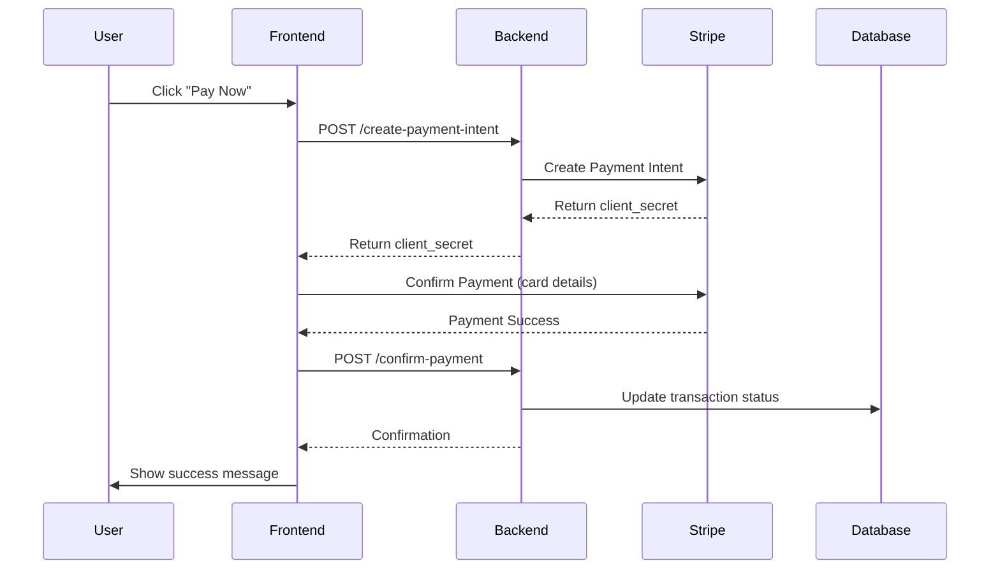

# 💳 Payment Gateway Integration Guide

## 🎯 **Where is the Payment Gateway Working?**

The payment gateway is fully integrated using **Stripe** and works across multiple components in your EV Charging Station system.

---

## 📍 **Payment Gateway Locations**

### 🔧 **Backend Implementation**

#### 1. **Transaction Routes** (`Backend/routes/transactionRoutes.js`)
```javascript
// Payment endpoints
POST /api/transactions/create-payment-intent  // Create Stripe payment intent
POST /api/transactions/confirm-payment        // Confirm payment completion
GET  /api/transactions/user-transactions      // Get user's payment history
POST /api/transactions/refund                 // Process refunds
POST /api/transactions/penalty                // Apply penalties
GET  /api/transactions/analytics              // Payment analytics
```

#### 2. **Transaction Controller** (`Backend/controllers/transactionController.js`)
- Handles payment intent creation
- Manages payment confirmation
- Processes refunds and penalties
- Provides transaction analytics

#### 3. **Transaction Service** (`Backend/services/transactionService.js`)
- **Stripe Integration**: Direct API calls to Stripe
- **Payment Processing**: Creates payment intents, confirms payments
- **Database Management**: Stores transaction records
- **Refund Logic**: Automatic refund calculations based on cancellation time

#### 4. **Database Schema** (`Backend/prisma/schema.prisma`)
```prisma
model Transaction {
  id        String            @id @default(uuid())
  userId    String
  amount    Float
  type      TransactionType   // PAYMENT, PENALTY, REFUND
  status    TransactionStatus // PENDING, COMPLETED, FAILED
  bookingId String?
  // ... other fields
}
```

### 🎨 **Frontend Implementation**

#### 1. **Payment Modal Component** (`Frontend/src/components/Payment/PaymentModal.jsx`)
- **Stripe Elements Integration**: Secure card input
- **Payment Form**: User-friendly payment interface
- **Real-time Processing**: Shows payment status
- **Error Handling**: User-friendly error messages

#### 2. **API Integration** (`Frontend/src/services/api.js`)
```javascript
export const transactionEndpoints = {
  CREATE_PAYMENT_INTENT_API: BASE_URL + "/transactions/create-payment-intent",
  CONFIRM_PAYMENT_API: BASE_URL + "/transactions/confirm-payment",
  GET_USER_TRANSACTIONS_API: BASE_URL + "/transactions/user-transactions",
  PROCESS_REFUND_API: BASE_URL + "/transactions/refund",
  // ... other endpoints
}
```

---

## 🔄 **Payment Flow**

### 📱 **User Journey**
1. **Book Charging Slot** → User selects station and time
2. **Payment Required** → System calculates amount
3. **Payment Modal Opens** → Stripe payment form appears
4. **Enter Card Details** → Secure Stripe Elements form
5. **Process Payment** → Stripe handles card processing
6. **Confirm Booking** → Backend updates booking status
7. **Email Receipt** → User receives confirmation email

### 🔧 **Technical Flow**


---

## 🎮 **How to Use the Payment Gateway**

### 1. **In Booking Flow**
```javascript
// Example usage in a booking component
import PaymentModal from '../components/Payment/PaymentModal';

const BookingComponent = () => {
  const [showPayment, setShowPayment] = useState(false);
  const [bookingData, setBookingData] = useState(null);

  const handlePayment = (booking, amount) => {
    setBookingData({ bookingId: booking.id, amount });
    setShowPayment(true);
  };

  const handlePaymentSuccess = (paymentIntent) => {
    console.log('Payment successful!', paymentIntent);
    setShowPayment(false);
    // Redirect to booking confirmation
  };

  return (
    <>
      {/* Your booking form */}
      <button onClick={() => handlePayment(booking, 500)}>
        Pay ₹500
      </button>

      {showPayment && (
        <PaymentModal
          bookingId={bookingData.bookingId}
          amount={bookingData.amount}
          onSuccess={handlePaymentSuccess}
          onCancel={() => setShowPayment(false)}
        />
      )}
    </>
  );
};
```

### 2. **Environment Configuration**
```env
# Backend (.env)
STRIPE_SECRET_KEY=sk_test_your_stripe_secret_key_here

# Frontend (.env)
VITE_STRIPE_PUBLISHABLE_KEY=pk_test_your_stripe_publishable_key_here
```

---

## 🧪 **Testing the Payment Gateway**

### 1. **Test Card Numbers** (Stripe Test Mode)
```
✅ Success: 4242 4242 4242 4242
❌ Decline: 4000 0000 0000 0002
🔄 3D Secure: 4000 0025 0000 3155
💳 Any future expiry date (e.g., 12/25)
🔢 Any 3-digit CVC
```

### 2. **Backend Testing**
```bash
# Test payment intent creation
curl -X POST http://localhost:4000/api/transactions/create-payment-intent \
  -H "Content-Type: application/json" \
  -H "Authorization: Bearer YOUR_JWT_TOKEN" \
  -d '{"bookingId": "booking-id", "amount": 500}'

# Test user transactions
curl -X GET http://localhost:4000/api/transactions/user-transactions \
  -H "Authorization: Bearer YOUR_JWT_TOKEN"
```

### 3. **Frontend Testing**
- Navigate to booking flow
- Select a charging slot
- Click "Pay Now"
- Use test card numbers
- Verify payment completion

---

## 💰 **Payment Features**

### ✅ **Supported Features**
- **Credit/Debit Cards**: Visa, Mastercard, American Express
- **Indian Payment Methods**: UPI, Net Banking (via Stripe India)
- **Currency**: Indian Rupees (INR)
- **Security**: PCI DSS compliant via Stripe
- **3D Secure**: Automatic authentication when required

### 🔄 **Transaction Types**
1. **PAYMENT**: Regular booking payments
2. **REFUND**: Automatic refunds for cancellations
3. **PENALTY**: Late cancellation or no-show penalties

### 📊 **Refund Policy**
```javascript
// Automatic refund calculation
if (hoursUntilStart >= 24) {
    refund = 100%; // Full refund
} else if (hoursUntilStart >= 2) {
    refund = 50%;  // Partial refund
} else {
    refund = 0%;   // No refund
}
```

---

## 🔍 **Where to Find Payment Gateway in Action**

### 1. **User Booking Flow**
- **Location**: `Frontend/src/components/UserFiles/BookSlotPage.jsx`
- **Trigger**: After selecting charging slot and time
- **Action**: Opens PaymentModal for payment processing

### 2. **Transaction History**
- **Location**: User dashboard → My Transactions
- **Shows**: All payments, refunds, and penalties
- **Features**: Download receipts, view details

### 3. **Owner Analytics**
- **Location**: Owner dashboard → Revenue Analytics
- **Shows**: Payment trends, revenue reports
- **Features**: Date filtering, export data

### 4. **Admin Panel**
- **Location**: Admin dashboard → Transaction Management
- **Features**: Process refunds, apply penalties, view all transactions

---

## 🚨 **Troubleshooting**

### Common Issues:

1. **"Payment gateway not configured"**
   - **Solution**: Set `STRIPE_SECRET_KEY` in backend `.env`

2. **"Stripe is not defined"**
   - **Solution**: Set `VITE_STRIPE_PUBLISHABLE_KEY` in frontend `.env`

3. **Payment fails silently**
   - **Check**: Browser console for errors
   - **Verify**: Network tab for API calls
   - **Test**: Use Stripe test card numbers

4. **Webhook issues**
   - **Setup**: Stripe webhook endpoints
   - **Verify**: Webhook secret configuration

---

## 📈 **Payment Analytics Available**

### 📊 **For Users**
- Payment history
- Refund tracking
- Spending analytics
- Receipt downloads

### 💼 **For Station Owners**
- Revenue reports
- Payment trends
- Refund analytics
- Customer payment behavior

### 👨‍💼 **For Admins**
- System-wide payment analytics
- Transaction monitoring
- Fraud detection
- Revenue optimization

---

## 🎯 **Next Steps to Activate**

1. **Get Stripe Account**: Sign up at stripe.com
2. **Configure API Keys**: Add to environment variables
3. **Test Integration**: Use test card numbers
4. **Go Live**: Switch to live API keys
5. **Setup Webhooks**: For real-time updates
6. **Monitor Transactions**: Use Stripe dashboard

---

**💳 Your payment gateway is fully implemented and ready to process real transactions!**

The system supports the complete payment lifecycle from booking to refunds, with comprehensive error handling and user-friendly interfaces.